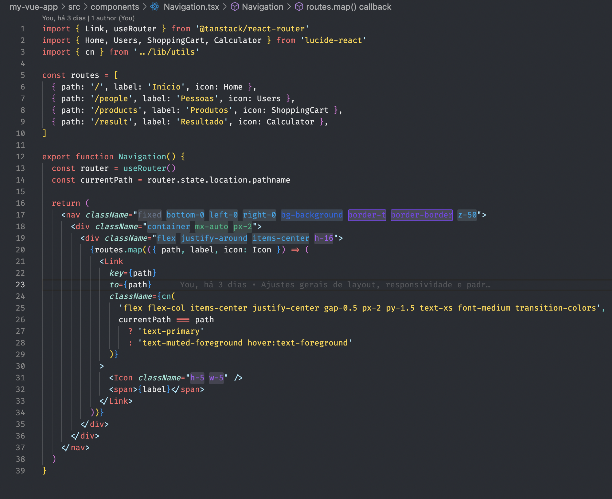

# TailAid

<p align="center">
  
</p>

<p align="center">
  <strong>Smarter Tailwind CSS development inside VS Code.</strong><br/>
  Color-coded class highlighting, one-click sorting, a class explorer, and full support for custom classes.
</p>

<p align="center">
  
</p>

---

## Features

### 🎨 Color-coded Syntax Highlighting

Every Tailwind class is instantly highlighted with a distinct color based on its category — making large `className` strings scannable at a glance.

| Category | Color |
|---|---|
| Layout | Sky blue |
| Spacing | Emerald green |
| Sizing | Purple |
| Typography | Yellow |
| Color / Background | Blue |
| Border | Violet |
| Effect | Pink |
| Animation | Orange |
| Transform | Teal |
| Interactivity | Red |
| SVG | Green |
| Table | Amber |
| Accessibility | Gray |

Variants like `hover:`, `focus:`, `md:`, `dark:lg:` are fully supported — the base class is always correctly identified.

---

### ↕️ Sort Classes by Category

Instantly reorganize the classes inside any `class` or `className` attribute into a consistent, readable order.

**Via Command Palette** (`Ctrl+Shift+P` / `Cmd+Shift+P`):
```
TailAid: Sort Tailwind Classes by Category
```

**Via keyboard shortcut:**

| OS | Shortcut |
|---|---|
| Windows / Linux | `Ctrl + Shift + T` |
| macOS | `Cmd + Shift + T` |

Classes are sorted in this canonical order:

`Layout` → `Sizing` → `Spacing` → `Typography` → `Color` → `Border` → `Effect` → `Animation` → `Transform` → `Interactivity` → `SVG` → `Table` → `Accessibility`

---

### 🗂️ Class Explorer

Browse all known Tailwind classes organized by category in the VS Code sidebar. Click any class to insert it directly into your code.

---

### 🔍 Hover Information

Hover over any Tailwind class to see its category and description without leaving your editor.

---

### ⚙️ Custom Classes via `tailaid.config.json`

Define your own project-specific classes with custom categories and highlight colors.

**Generate the config file via Command Palette:**
```
TailAid: Create Config File (tailaid.config.json)
```

This creates a `tailaid.config.json` at your project root:

```json
{
  "customClasses": [
    {
      "prefix": ["btn-", "card"],
      "category": "Components",
      "color": "#a78bfa",
      "backgroundColor": "rgba(167,139,250,0.12)"
    },
    {
      "prefix": ["brand-"],
      "category": "Brand",
      "color": "#fb923c",
      "backgroundColor": "rgba(251,146,60,0.10)"
    }
  ]
}
```

| Field | Type | Required | Description |
|---|---|---|---|
| `prefix` | `string \| string[]` | ✅ | One or more class prefixes/names to match |
| `category` | `string` | ✅ | Category label used for highlighting and sorting |
| `color` | `string` | ✅ | Text highlight color (any CSS color value) |
| `backgroundColor` | `string` | ❌ | Background tint (any CSS color value) |

> **Hot-reload:** The extension watches `tailaid.config.json` for changes and re-applies highlights instantly — no restart required.

> **Priority:** Custom classes always take precedence over built-in Tailwind categories.

---

## Installation

1. Open VS Code
2. Go to the Extensions view (`Ctrl+Shift+X` / `Cmd+Shift+X`)
3. Search for **TailAid**
4. Click **Install**

**Supported languages:** `html`, `javascript`, `typescript`, `javascriptreact`, `typescriptreact`

---

## Contributing

Contributions are welcome! Check out [CONTRIBUTING.md](CONTRIBUTING.md) for guidelines.

## License

MIT — see [LICENSE](LICENSE.md) for details.
